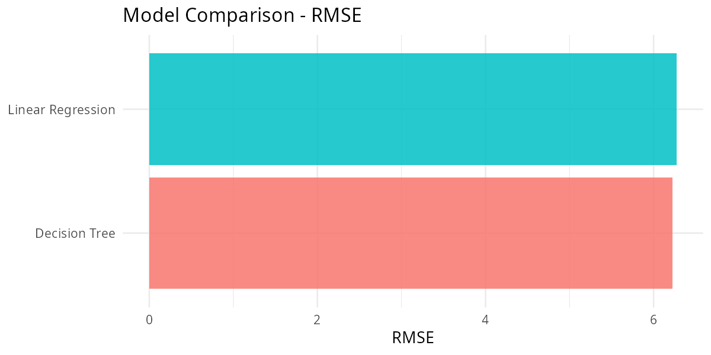
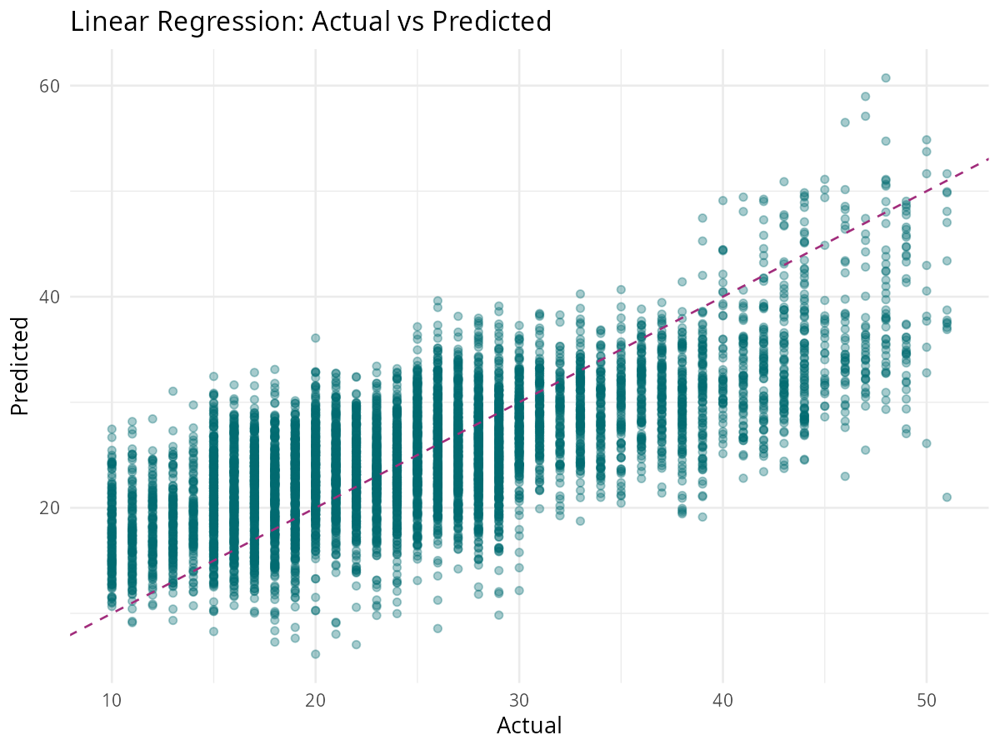
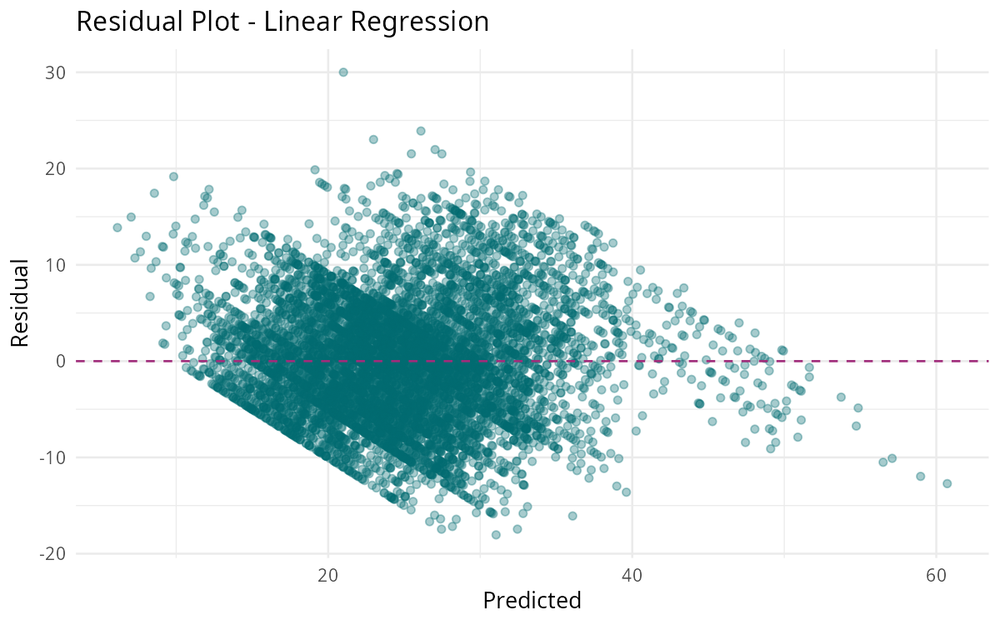
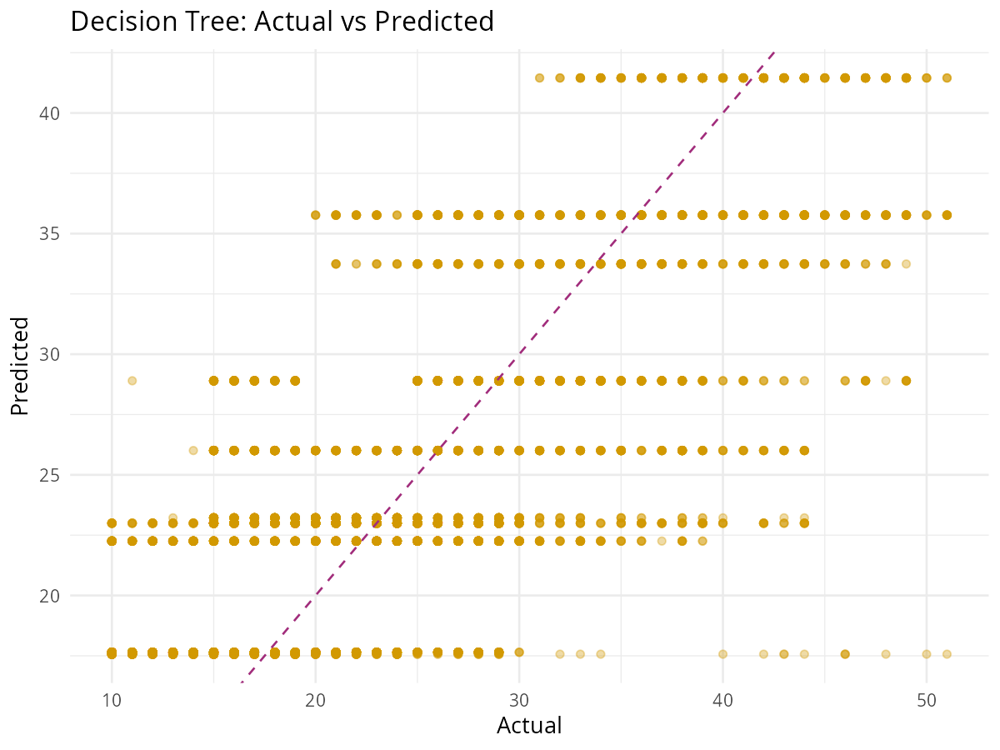

```{r setup, include=FALSE}
pkgs <- c("tidyverse", "knitr", "kableExtra", "scales", "ggplot2")
for (p in pkgs) if (!p %in% rownames(installed.packages())) install.packages(p, quiet = TRUE)
library(tidyverse)
library(knitr)
library(kableExtra)
library(scales)
library(ggplot2)

df       <- read_csv("../output/food_delivery_clean.csv", show_col_types = FALSE)
results  <- read_csv("../output/model_comparison.csv",   show_col_types = FALSE)
coef_df  <- read_csv("../output/lm_coefficients.csv",    show_col_types = FALSE)
```

---

## The Problem

Imagine you are the operations head at a growing food delivery company.

Every day, thousands of orders are placed across the city. Riders are dispatched. Customers wait. But lately, customer satisfaction is dropping because late deliveries are becoming common.

This creates two business questions:

> 1. What is actually causing delays?  
> 2. Can we predict delivery time before the order is dispatched?

This project answers both questions using data.

```{r avg-delivery}
avg <- round(mean(df$time_taken_min, na.rm = TRUE), 1)
med <- round(median(df$time_taken_min, na.rm = TRUE), 1)
mx  <- round(max(df$time_taken_min, na.rm = TRUE), 1)

tibble(
  Metric = c("Average Delivery Time", "Median Delivery Time", "Longest Delivery"),
  Value  = paste(c(avg, med, mx), "min")
) |>
  kbl(caption = "Summary of delivery times across all orders") |>
  kable_styling(full_width = FALSE, bootstrap_options = c("striped", "hover"))
```

---

## Business context

For a delivery platform, every extra minute matters.

Longer delivery times can reduce customer trust, increase support complaints, raise refund costs, and make delivery operations less efficient. A business therefore needs both insight and prediction: insight to understand delays, and prediction to estimate delivery time in advance.

---

## Dataset

We analyse the cleaned food delivery dataset with operational, contextual, and behavioural variables.

```{r dataset-overview}
tibble(
  Column = c("Delivery Records", "Cities Covered", "Vehicle Types", "Target Variable"),
  Value  = c(
    format(nrow(df), big.mark = ","),
    n_distinct(df$city, na.rm = TRUE),
    n_distinct(df$type_of_vehicle, na.rm = TRUE),
    "time_taken_min"
  )
) |>
  kbl(caption = "Dataset overview") |>
  kable_styling(full_width = FALSE, bootstrap_options = c("striped", "hover"))
```

The models use features such as distance, pickup delay, traffic density, weather, city type, vehicle type, festival indicator, order type, rider age, rider rating, and time-related variables.

---

## Question 1

### Does distance explain delivery time?

Distance is the most obvious suspect. A longer route should usually take more time.

```{r distance-bucket-table}
df |>
  mutate(
    dist_bucket = cut(
      distance_km,
      breaks = c(0, 5, 10, 15, 20, Inf),
      labels = c("0–5 km", "5–10 km", "10–15 km", "15–20 km", "20+ km")
    )
  ) |>
  group_by(dist_bucket) |>
  summarise(
    Orders = n(),
    Avg_Time_Min = round(mean(time_taken_min, na.rm = TRUE), 1),
    Median_Time_Min = round(median(time_taken_min, na.rm = TRUE), 1),
    .groups = "drop"
  ) |>
  drop_na() |>
  kbl(caption = "Delivery time by distance bucket") |>
  kable_styling(full_width = FALSE, bootstrap_options = c("striped", "hover"))
```

**Interpretation:** Delivery time rises as distance rises, which confirms that route length is an important operational driver. However, distance alone does not explain all delays, so the business must also examine traffic, pickup delay, and timing effects.

---

## Question 2

### How much does traffic contribute?

Traffic is one of the strongest real-world constraints on delivery performance.

```{r traffic-table}
df |>
  filter(!is.na(road_traffic_density)) |>
  group_by(Traffic = road_traffic_density) |>
  summarise(
    Orders = n(),
    Avg_Time_Min = round(mean(time_taken_min, na.rm = TRUE), 1),
    Median_Time_Min = round(median(time_taken_min, na.rm = TRUE), 1),
    .groups = "drop"
  ) |>
  arrange(Avg_Time_Min) |>
  kbl(caption = "Delivery time by traffic condition") |>
  kable_styling(full_width = FALSE, bootstrap_options = c("striped", "hover"))
```

```{r traffic-impact}
low_time <- mean(df$time_taken_min[df$road_traffic_density == "Low"], na.rm = TRUE)
jam_time <- mean(df$time_taken_min[df$road_traffic_density == "Jam"], na.rm = TRUE)
tibble(
  Comparison = "Jam traffic vs Low traffic",
  `Extra average minutes` = round(jam_time - low_time, 1)
) |>
  kbl(caption = "Estimated extra delay caused by traffic jams") |>
  kable_styling(full_width = FALSE, bootstrap_options = c("striped", "hover"))
```

**Interpretation:** Traffic density is not just a background condition; it is a direct operational risk. If jam conditions add several minutes on average, then ETA systems and rider allocation should respond dynamically to traffic conditions.

---

## Question 3

### Is pickup delay a hidden bottleneck?

Pickup delay is the time between order placement and actual pickup. It often reflects restaurant-side delay, rider assignment lag, or dispatch inefficiency.

```{r pickup-delay-analysis}
df |>
  filter(!is.na(pickup_delay_min), pickup_delay_min >= 0) |>
  mutate(
    delay_bucket = cut(
      pickup_delay_min,
      breaks = c(0, 5, 10, 20, 40, Inf),
      labels = c("0–5 min", "5–10 min", "10–20 min", "20–40 min", "40+ min")
    )
  ) |>
  group_by(delay_bucket) |>
  summarise(
    Orders = n(),
    Avg_Total_Delivery = round(mean(time_taken_min, na.rm = TRUE), 1),
    .groups = "drop"
  ) |>
  drop_na() |>
  kbl(caption = "Total delivery time by pickup delay bucket") |>
  kable_styling(full_width = FALSE, bootstrap_options = c("striped", "hover"))
```

**Interpretation:** Pickup delay is one of the most actionable variables because it is partly controllable. Businesses cannot control weather, but they can improve restaurant coordination, rider dispatch timing, and batching logic.

---

## Question 4

### Do rush hour and city type change performance?

Time of day and city environment shape the delivery ecosystem.

```{r rush-hour-table}
df |>
  filter(!is.na(is_rush_hour)) |>
  group_by(`Rush Hour` = ifelse(is_rush_hour == 1, "Yes", "No")) |>
  summarise(
    Orders = n(),
    Avg_Time_Min = round(mean(time_taken_min, na.rm = TRUE), 1),
    .groups = "drop"
  ) |>
  kbl(caption = "Rush hour vs non-rush hour performance") |>
  kable_styling(full_width = FALSE, bootstrap_options = c("striped", "hover"))
```

```{r city-table}
df |>
  filter(!is.na(city)) |>
  group_by(City = city) |>
  summarise(
    Orders = n(),
    Avg_Time_Min = round(mean(time_taken_min, na.rm = TRUE), 1),
    Avg_Distance = round(mean(distance_km, na.rm = TRUE), 1),
    .groups = "drop"
  ) |>
  arrange(Avg_Time_Min) |>
  kbl(caption = "Delivery performance by city type") |>
  kable_styling(full_width = FALSE, bootstrap_options = c("striped", "hover"))
```

**Interpretation:** If metro deliveries are slower despite strong market density, that suggests congestion or dispatch overload. The business can use this insight to position more riders in peak metro zones and refine incentive strategies.

---

## Question 5

### Do weather and festivals affect delivery outcomes?

Some variables are outside direct control, but still important for planning.

```{r weather-table}
df |>
  filter(!is.na(weather_conditions)) |>
  group_by(Weather = weather_conditions) |>
  summarise(
    Orders = n(),
    Avg_Time_Min = round(mean(time_taken_min, na.rm = TRUE), 1),
    .groups = "drop"
  ) |>
  arrange(desc(Avg_Time_Min)) |>
  kbl(caption = "Average delivery time by weather condition") |>
  kable_styling(full_width = FALSE, bootstrap_options = c("striped", "hover"))
```

```{r festival-table}
df |>
  filter(!is.na(festival)) |>
  group_by(Festival = festival) |>
  summarise(
    Orders = n(),
    Avg_Time_Min = round(mean(time_taken_min, na.rm = TRUE), 1),
    .groups = "drop"
  ) |>
  kbl(caption = "Average delivery time on festival vs non-festival days") |>
  kable_styling(full_width = FALSE, bootstrap_options = c("striped", "hover"))
```

**Interpretation:** These variables are useful for forecasting and customer communication. Even if the business cannot eliminate bad weather, it can adjust promises, staffing, and app messaging.

---

## Predictive modelling

After understanding the delay drivers, the next step is prediction.

We train two models:
- **Linear Regression** for interpretability.
- **Decision Tree Regression** for simple non-linear decision rules.

The goal is not only to get a good score, but also to produce a model the business can understand and use.

```{r model-results}
results |>
  arrange(RMSE) |>
  mutate(
    RMSE = round(RMSE, 2),
    MAE  = round(MAE, 2),
    R2   = round(R2, 3)
  ) |>
  kbl(caption = "Model performance on the test set") |>
  kable_styling(full_width = FALSE, bootstrap_options = c("striped", "hover"))
```

```{r rmse-plot, echo=FALSE, out.width='85%'}

```

**Interpretation:** The better model is the one with lower RMSE and MAE and higher R2. In business terms, lower MAE means the ETA shown to the customer is closer to reality on average.

---

## How good are the predictions?

The following plots compare actual and predicted delivery time.

### Linear Regression

```{r lm-actual-predicted, echo=FALSE, out.width='85%'}

```

```{r lm-residual, echo=FALSE, out.width='85%'}

```

### Decision Tree

```{r dt-actual-predicted, echo=FALSE, out.width='85%'}

```

**Interpretation:** The closer the points are to the diagonal line, the better the prediction. Residual plots help us see whether the model systematically overpredicts or underpredicts.

---

## Which features matter most?

Linear Regression is especially useful because coefficients can be interpreted directly.

```{r coefficients-table}
coef_df |>
  filter(Feature != "(Intercept)") |>
  mutate(Direction = ifelse(Coefficient > 0, "Increases time", "Decreases time")) |>
  arrange(desc(abs(Coefficient))) |>
  slice_head(n = 15) |>
  select(Feature, Coefficient, Direction) |>
  kbl(caption = "Top 15 coefficients from Linear Regression") |>
  kable_styling(full_width = FALSE, bootstrap_options = c("striped", "hover"))
```

Here is how to read the coefficient table:
- A **positive coefficient** means the variable increases predicted delivery time.
- A **negative coefficient** means the variable reduces predicted delivery time.
- Larger absolute values indicate stronger influence, though interpretation must consider variable scale and encoding.

### Business interpretation of likely important features

- `distance_km`: longer routes increase time.
- `pickup_delay_min`: restaurant or dispatch delay directly affects final delivery time.
- `road_traffic_density_ord`: heavier traffic increases travel time.
- `is_rush_hour`: peak periods create congestion and slower operations.
- categorical dummy variables: some cities, weather types, or vehicle types may systematically change performance.

---

## What does the model answer for the business?

The modelling phase gives practical answers:

### 1. Can we estimate delivery time before dispatch?
Yes. The models provide an estimated delivery time using information available early in the order lifecycle.

### 2. What variables should managers monitor most closely?
Distance, traffic, pickup delay, rush hour status, weather, and city type.

### 3. What kind of delays can be acted on immediately?
Pickup delay and rush-hour allocation can be improved operationally. Traffic and weather should be handled through communication and routing strategy.

### 4. Which model is better for this project?
If the Decision Tree performs better, it is better for prediction. If Linear Regression performs competitively, it is better for explanation and reporting. For a student project, presenting both gives a balanced and credible analysis.

---

## Recommendations

Based on the full analysis, the business should consider the following actions:

```{r recommendations}
tibble(
  Problem = c(
    "High traffic delays",
    "Pickup-side bottlenecks",
    "Rush hour congestion",
    "Weather-related slowdown",
    "Uneven city performance"
  ),
  Recommendation = c(
    "Use traffic-aware ETA estimation and dynamic rider routing.",
    "Track restaurant prep delays and assign riders closer to pickup points.",
    "Pre-position more riders before lunch and dinner peaks.",
    "Show delay warnings during rain, fog, or storms and adjust ETA promises.",
    "Allocate more fleet capacity to slower-performing city zones."
  ),
  Expected_Benefit = c(
    "More accurate ETAs and fewer late-order complaints",
    "Lower end-to-end delivery time",
    "Better service during peak demand windows",
    "Improved customer trust and reduced refund pressure",
    "More balanced service quality across regions"
  )
) |>
  kbl(caption = "Actionable business recommendations") |>
  kable_styling(full_width = TRUE, bootstrap_options = c("striped", "hover"))
```

---

## Final takeaway

This project shows that food delivery delays are not random. They are shaped by identifiable operational patterns such as distance, traffic, pickup lag, rush-hour conditions, city type, weather, and festival periods.

By combining descriptive analysis with predictive modelling, the business can do two things:
1. **understand why delays happen**, and
2. **predict likely delivery time before dispatch**.

That makes the analysis useful not only as a student modelling exercise, but also as a decision-support tool for delivery operations.

---

## Navigation

- [Back to EDA](02_eda.qmd)
- [Return to Home](../index.qmd)