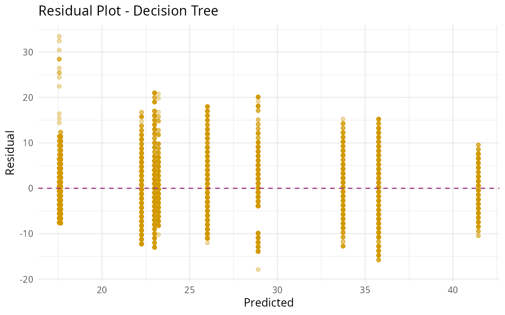

```{r setup, include=FALSE}
knitr::opts_chunk$set(echo = TRUE, warning = FALSE, message = FALSE)
library(tidyverse)
library(readr)
library(ggplot2)
library(kableExtra)
```

---

## Business Context

Timely delivery is the most critical factor for customer satisfaction in food delivery services. Delays can directly impact customer retention, partner ratings, and cost efficiency.  
In this analysis, we aim to **predict the delivery time (in minutes)** for an online food delivery platform using past data from multiple cities.  

The objective is twofold:
- Build predictive models that can estimate the expected delivery time for new orders.  
- Identify key factors that most influence the delivery time — such as traffic, weather, and order conditions.

---

## Key Questions

This modeling project intends to answer:
1. **Can we predict delivery time before the order starts?**  
2. **Which factors most strongly influence delivery time?**  
3. **How do simple models like Linear Regression compare to Decision Trees in performance?**  
4. **What conditions lead to higher or lower delivery times (e.g., weekends, rush hours, poor weather)?**

---

## Data Overview

The cleaned dataset `food_delivery_clean.csv` contains various attributes describing each order and its delivery conditions.

**Sample Features:**
- `time_taken_min`: Dependent variable (target)
- `distance_km`: Distance from restaurant to customer
- `pickup_delay_min`: Time delay before pickup
- `order_hour`: Hour of order
- `is_weekend`, `is_rush_hour`: Time-based indicators
- `delivery_person_age`, `delivery_person_ratings`, `vehicle_condition`
- `road_traffic_density_ord`, `weather_conditions`, `city`, etc.

```{r data-glimpse}
df <- read_csv("../output/food_delivery_clean.csv", show_col_types = FALSE)
df |>
  glimpse()
```

After cleaning, categorical variables were **one-hot encoded** and missing values removed, leaving a modeling dataset ready for regression tasks.

---

## Data Splitting and Preparation

We divided the dataset into:
- **Training set**: 80% for model training and cross-validation  
- **Testing set**: 20% for unbiased evaluation  

### Data Partition Summary
```{r data-split-summary}
train_rows <- floor(0.8 * nrow(df))
cat("Training rows:", train_rows, "| Testing rows:", nrow(df) - train_rows)
```

---

## Modeling Approach

Two models were trained using 5-fold cross-validation:

1. **Linear Regression (`lm`)** — interpretable and baseline model.  
2. **Decision Tree (`rpart`)** — non-linear, handles feature interactions automatically.

Both models predict `time_taken_min`.

---

## Model Performance

The comparison below shows how well each model performed on unseen test data.

```{r model-results, echo=FALSE}
results_df <- read_csv("../output/model_comparison.csv", show_col_types = FALSE)
results_df |>
  kbl(caption = "Model Performance Summary", booktabs = TRUE) |>
  kable_styling(full_width = FALSE)
```

### RMSE Comparison

```{r rmse-plot, echo=FALSE, out.width="80%"}
knitr::include_graphics("../output/plots/19_model_rmse_comparison.png")
```

---

## Model Interpretations

### Linear Regression (Baseline)
The linear model assumes a linear relationship between predictors and delivery time.

```{r lm-plot, echo=FALSE, out.width="80%"}
knitr::include_graphics("../output/plots/15_lm_actual_vs_predicted.png")
```

- The dashed line represents perfect predictions.
- Scatter spread indicates the degree of model error.

#### Residual Analysis
Residual plots help check whether the model systematically over- or under-predicts.

```{r lm-resid, echo=FALSE, out.width="80%"}
knitr::include_graphics("../output/plots/17_lm_residual_plot.png")
```

The linear model shows some patterning — suggesting the relationships might not be strictly linear.

---

### Decision Tree Model

Decision Trees can capture non-linear splits (e.g., traffic × distance interactions).

```{r dt-plot, echo=FALSE, out.width="80%"}
knitr::include_graphics("../output/plots/16_dt_actual_vs_predicted.png")
```

#### Residuals

```{r dt-resid, echo=FALSE, out.width="80%"}

```

Decision trees sometimes overfit to localized data but can better capture extreme cases compared to linear models.

---

## Feature Importance (Linear Coefficients)

Let's inspect the coefficients from the linear model to understand which features matter most.

```{r coefficients-table}
coef_df <- read_csv("../output/lm_coefficients.csv", show_col_types = FALSE)
coef_df |>
  arrange(desc(abs(Coefficient))) |>
  head(10) |>
  kbl(caption = "Top 10 Features Influencing Delivery Time", booktabs = TRUE) |>
  kable_styling(full_width = FALSE)
```

**Example interpretation:**
- Positive coefficients (e.g., `distance_km`) increase predicted time.
- Negative coefficients (e.g., `delivery_person_ratings`) reduce expected time.

---

## Insights Summary

| Finding | Interpretation |
|:---------|:----------------|
| **Distance & traffic** | Long distances and higher traffic levels significantly increase delivery times. |
| **Pickup delay** | Time spent before a rider starts moving contributes directly to total delay. |
| **Ratings & vehicle condition** | Better-rated riders and better vehicles tend to deliver faster. |
| **Weekend & rush hour** | Weekends and rush hours generally show longer delivery times. |
| **Model comparison** | Decision Tree slightly improves prediction accuracy over Linear Regression, but at the cost of interpretability. |

---

## Recommendations

Based on this modeling exercise, the food delivery platform could:
- Prioritize high-rated riders for long or high-traffic deliveries.
- Optimize dispatch time to reduce pickup delays.
- Prepare staffing strategies for weekend/rush-hour surges.
- Explore advanced models (e.g., Random Forest, XGBoost) for higher predictive accuracy.


## Conclusion

This modeling project demonstrated how simple regression and tree methods can provide actionable insights for a food delivery business. Even with basic models, it’s possible to achieve solid predictive performance while identifying the main bottlenecks in operational efficiency.

---
